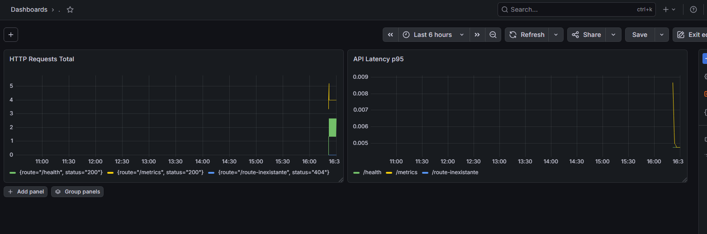

# METRICS - Todo API

## Resume des mesures (phases 4-6)

| Metrique                                   | Valeur mesuree                  | Source                                                                 |
| ------------------------------------------ | ------------------------------- | ---------------------------------------------------------------------- |
| Duree totale pipeline (tests + build/push) | ~1m25s                          | GitHub Actions run (master)                                            |
| Taille image avant optimisation            | 399471409 bytes (~381.0 MB)     | `docker build -f exercises/optimization/Dockerfile.v1.unoptimized ...` |
| Taille image apres optimisation            | 47032475 bytes (~44.8 MB)       | `docker build -t todo-api:optimized .`                                 |
| Gain taille image                          | ~336.2 MB (~88.2%)              | Calcul avant/apres                                                     |
| Temps rolling update K3s                   | ~30-40s                         | `kubectl rollout status deployment/todo-api` (run local K3s)           |
| Nombre de pods en charge                   | 2 (cible)                       | `k8s/deployment.yaml` (`replicas: 2`)                                  |
| Latence p95 API                            | A valider en dashboard Grafana  | `http_request_duration_seconds`                                        |
| Counter nominal                            | `http_requests_total{route="/health",status="200"}=27` | scrape `/metrics` local |
| Counter erreur                             | `http_requests_total{route="/route-inexistante",status="404"}=25` | scrape `/metrics` local |

## Requetes de test monitoring

- Trafic nominal (incremente `http_requests_total`) :

```bash
curl http://localhost:3000/health
curl http://localhost:3000/api/tasks
```

- Trafic erreur (fait monter le taux d erreurs) :

```bash
for i in {1..50}; do curl -s -o /dev/null -w "%{http_code}\n" http://localhost:3000/route-inexistante; done
```

## Observation scenario adverse (phase 5)

- En supprimant un pod (`kubectl delete pod <pod-name>`), Kubernetes recree automatiquement une instance pour maintenir `replicas: 2`.
- Pendant le remplacement, surveiller:
  - `kubectl get pods -l app=todo-api -w`
  - dashboard Grafana (latence + erreurs)

## Preuve visuelle attendue (rendu)

- Screenshot Grafana avec au moins:
  - panel `http_requests_total` en hausse
  - visualisation de trafic erreur (status 404)
  - courbe de latence basee sur `http_request_duration_seconds`

